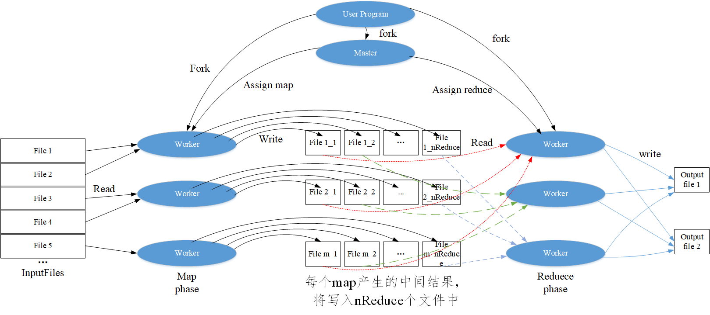
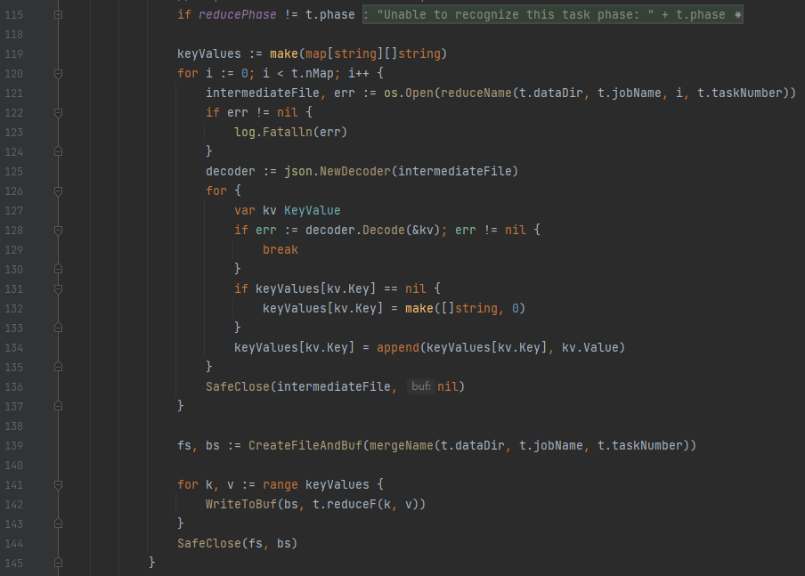
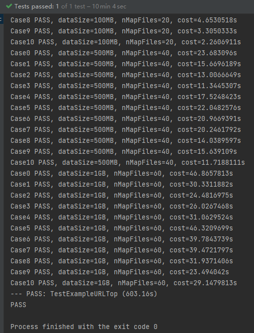
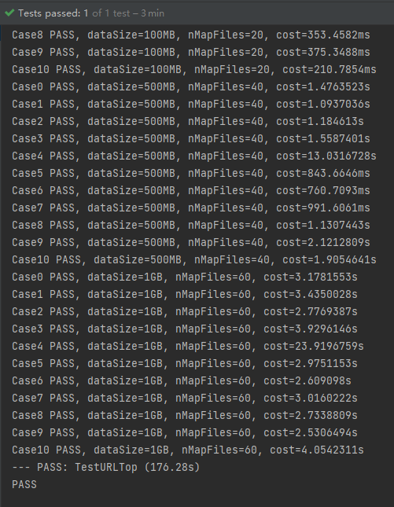

# VLDB Summer School 2021 Course

## 作业1. 完成 Map-Reduce 框架
- 流程图
 
- 实现Reduce阶段
1. 获取文件路径

    在map阶段，每个map task （记作，*i*）产生的中间结果，将分配到nReduce个文件中，分别命名为xxx-i-0、xxx-i-1、...、 xxx-i-(nReduce-1)。其中，对于任意一个key-value，将存储在xxx-i-(hash(key)%nReduce)文件中。因此，在reduce阶段，我们需要拿到每一个map操作为当前reduce task保存中间结果，并做为输入。（Line 121）

2. 读取kv数据，并合并同一key的value

    由于map阶段使用了json.NewEncode，因此reduce阶段需要使用json.NewDecoder，打开文件解码器，并根据key将value加入map对象中，最终形成key-Values。（Lines 125-134）

3. 调用reduceF，并输出reduce结果

    调用reduceF处理key-values，并将结果写入输出文件中（Lines 141-143）

​	代码：

```go
if reducePhase != t.phase {
   panic("Unable to recognize this task phase: " + t.phase)
}

keyValues := make(map[string][]string)
for i := 0; i < t.nMap; i++ {
   intermediateFile, err := os.Open(reduceName(t.dataDir, t.jobName, i, t.taskNumber))
   if err != nil {
      log.Fatalln(err)
   }
   decoder := json.NewDecoder(intermediateFile)
   for {
      var kv KeyValue
      if err := decoder.Decode(&kv); err != nil {
         break
      }
      if keyValues[kv.Key] == nil {
         keyValues[kv.Key] = make([]string, 0)
      }
     keyValues[kv.Key] = append(keyValues[kv.Key], kv.Value)
   }
   SafeClose(intermediateFile, nil)
}

fs, bs := CreateFileAndBuf(mergeName(t.dataDir, t.jobName, t.taskNumber))

for k, v := range keyValues {
    WriteToBuf(bs, t.reduceF(k, v))
}
SafeClose(fs, bs)
```

- 实现run流程
1. 分发reduce的任务到nReduce个workers来执行。注意，分发每个map任务，都添加了一个信号量，并必须等待所有map任务都执行完毕，才会分发reduce阶段的任务。
2. 将reduce阶段产品的结果，放入channel中，让测试代码拿到结果，并检查

​	代码

```go
reduceTasks := make([]*task, 0, nReduce)
for i := 0; i < nReduce; i++ {
   t := &task{
      dataDir:    dataDir,
      jobName:    jobName,
      phase:      reducePhase,
      taskNumber: i,
      nMap:       nMap,
      nReduce:    nReduce,
      reduceF:    reduceF,
   }
   t.wg.Add(1)
   reduceTasks = append(reduceTasks, t)
   go func() { c.taskCh <- t }()
}
for _, t := range reduceTasks {
   t.wg.Wait()
}

//output files
outputFiles := make([]string, 0, nReduce)
for i := 0; i < nReduce; i++ {
   outputFiles = append(outputFiles, mergeName(dataDir, jobName, i))
}
notify <- outputFiles
```

- 执行

  ```
  test_example:
     go test -v -run=TestExampleURLTop
  ```

  总用时：603.16s




## 作业2. 基于 Map-Reduce 框架编写 Map-Reduce 函数

实现思路：

1.  在第一轮的map阶段，程序会读取文件，并处理为key-value的形式。在此阶段，便可以先统计相同key(即，相同URL)出现的次数，记作localURLCount。再将[URL, localURLCount]存储在中间文件中，以便reduce阶段合并不同map阶段的localURLCount。这样做的好处是，避免了了大量的I/O开销。

   ```go
   func URLCountMap(filename string, contents string) []KeyValue {
      lines := strings.Split(contents, "\n")
      kvs := make([]KeyValue, 0, len(lines))
      localURLCount := make(map[string]int)
      for _, l := range lines {
         l = strings.TrimSpace(l)
         if len(l) == 0 {
            continue
         }
         if _, err := localURLCount[l]; !err {
            localURLCount[l] = 0
         }
         localURLCount[l]++
      }
      for url, count := range localURLCount {
         kvs = append(kvs, KeyValue{url, strconv.Itoa(count)})
      }
      return kvs
   }
   ```

2. 在第一轮的reduce阶段，累计每个key在不同map任务中计算出的localURLCount，即可得到当前URL的次数。

   ```go
   func URLCountReduce(key string, values []string) string {
      count := 0
      for _, value := range values {
         v, err := strconv.Atoi(value)
         if err != nil {
            // handle error
            fmt.Println(err)
         }
         count += v
      }
      return fmt.Sprintf("%s %s\n", key, strconv.Itoa(count))
   }
   ```

3. 在第二轮的map阶段，调用TopN(localCount, 10)挑选出，局部Tok10，再只将局部Top10的URL分发到reduce阶段。注意，因为reduce阶段对比所有的url才能得到最终的TokN。因此，map阶段输入的key都统一为“”，value为“URL count”，这样才能保证所有的结果都会在同一个reduce任务中执行。

   ```go
   func URLTop10Map(filename string, contents string) []KeyValue {
      lines := strings.Split(contents, "\n")
      kvs := make([]KeyValue, 0, 10)
      localCount := make(map[string]int)
      for _, l := range lines {
         v := strings.TrimSpace(l)
         if len(v) == 0 {
            continue
         }
         kv := strings.Split(l, " ")
         count, err := strconv.Atoi(kv[1])
         if err != nil {
            panic(err)
         }
         localCount[kv[0]] = count
         //kvs = append(kvs, KeyValue{"", l})
      }
   
      us, cs := TopN(localCount, 10)
      for i := range us {
         kvs = append(kvs, KeyValue{Key: "", Value: fmt.Sprintf("%s %d", us[i], cs[i])})
      }
      return kvs
   }
   ```

4. 在第二轮的reduce阶段，调用TopN(localCount, 10)挑选出，选出最终的Tok10。由于，上一步的map阶段，程序只输出了局部Tok10的URL，而非全部URL。因此，此阶段的开销将会很小。

   ```go
   func URLTop10Reduce(key string, values []string) string {
      cnts := make(map[string]int, len(values))
      for _, v := range values {
         v := strings.TrimSpace(v)
         if len(v) == 0 {
            continue
         }
         tmp := strings.Split(v, " ")
         n, err := strconv.Atoi(tmp[1])
         if err != nil {
            panic(err)
         }
         cnts[tmp[0]] = n
      }
   
      us, cs := TopN(cnts, 10)
      buf := new(bytes.Buffer)
      for i := range us {
         fmt.Fprintf(buf, "%s: %d\n", us[i], cs[i])
      }
      return buf.String()
   }
   ```

- 完整代码

  ```go
  package main
  
  import (
     "bytes"
     "fmt"
     "strconv"
     "strings"
  )
  
  // URLTop10 .
  func URLTop10(nWorkers int) RoundsArgs {
     // YOUR CODE HERE :)
     // And don't forget to document your idea.
     var args RoundsArgs
     // round 1: do url count
     args = append(args, RoundArgs{
        MapFunc:    URLCountMap,
        ReduceFunc: URLCountReduce,
        NReduce:    nWorkers,
     })
     // round 2: sort and get the 10 most frequent URLs
     args = append(args, RoundArgs{
        MapFunc:    URLTop10Map,
        ReduceFunc: URLTop10Reduce,
        NReduce:    1,
     })
     return args
  }
  
  // ExampleURLCountMap is the map function in the first round
  func URLCountMap(filename string, contents string) []KeyValue {
     lines := strings.Split(contents, "\n")
     kvs := make([]KeyValue, 0, len(lines))
     localURLCount := make(map[string]int)
     for _, l := range lines {
        l = strings.TrimSpace(l)
        if len(l) == 0 {
           continue
        }
        if _, err := localURLCount[l]; !err {
           localURLCount[l] = 0
        }
        localURLCount[l]++
     }
     for url, count := range localURLCount {
        kvs = append(kvs, KeyValue{url, strconv.Itoa(count)})
     }
     return kvs
  }
  
  // ExampleURLCountReduce is the reduce function in the first round
  func URLCountReduce(key string, values []string) string {
     count := 0
     for _, value := range values {
        v, err := strconv.Atoi(value)
        if err != nil {
           // handle error
           fmt.Println(err)
        }
        count += v
     }
     return fmt.Sprintf("%s %s\n", key, strconv.Itoa(count))
  }
  
  // ExampleURLTop10Map is the map function in the second round
  func URLTop10Map(filename string, contents string) []KeyValue {
     lines := strings.Split(contents, "\n")
     kvs := make([]KeyValue, 0, 10)
     localCount := make(map[string]int)
     for _, l := range lines {
        v := strings.TrimSpace(l)
        if len(v) == 0 {
           continue
        }
        kv := strings.Split(l, " ")
        count, err := strconv.Atoi(kv[1])
        if err != nil {
           panic(err)
        }
        localCount[kv[0]] = count
        //kvs = append(kvs, KeyValue{"", l})
     }
  
     us, cs := TopN(localCount, 10)
     for i := range us {
        kvs = append(kvs, KeyValue{Key: "", Value: fmt.Sprintf("%s %d", us[i], cs[i])})
     }
     return kvs
  }
  
  // ExampleURLTop10Reduce is the reduce function in the second round
  func URLTop10Reduce(key string, values []string) string {
     cnts := make(map[string]int, len(values))
     for _, v := range values {
        v := strings.TrimSpace(v)
        if len(v) == 0 {
           continue
        }
        tmp := strings.Split(v, " ")
        n, err := strconv.Atoi(tmp[1])
        if err != nil {
           panic(err)
        }
        cnts[tmp[0]] = n
     }
  
     us, cs := TopN(cnts, 10)
     buf := new(bytes.Buffer)
     for i := range us {
        fmt.Fprintf(buf, "%s: %d\n", us[i], cs[i])
     }
     return buf.String()
  }
  ```

- 执行

```
test_homework:
   go test -v -run=TestURLTop
```

总用时：176.28s




## 思考

在map阶段，采用ihash函数，可能会导致reduce任务不均衡的问题，例如所有URL都特别相似，它们极大可能会被分发到同一reduce task中，造成单一task执行时间过长。因此，若更好的分发策略，能使reduce阶段load banlancing，则可进一步提升性能。

