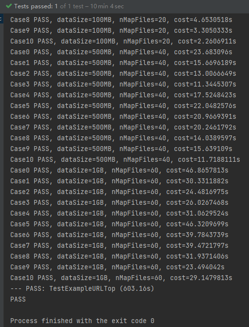
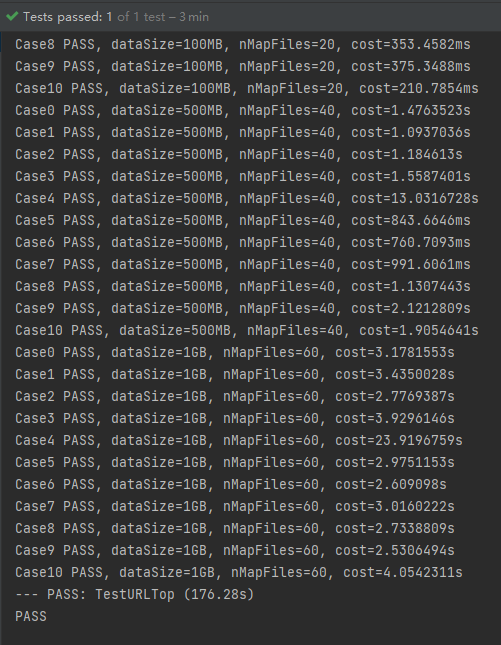
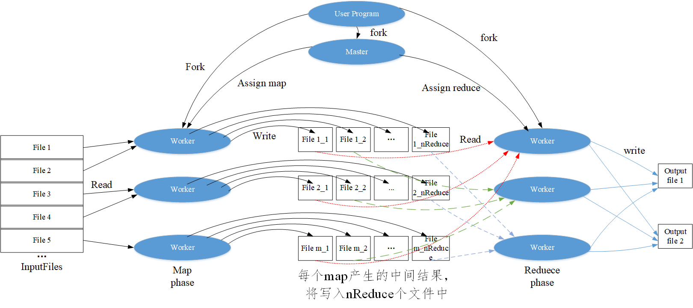

# Lab0 实验报告

## 实验结果

### 1. 完成 Map-Reduce 框架

`make test_example` 的实验截图



### 2. 基于 Map-Reduce 框架编写 Map-Reduce 函数

`make test_homework` 的实验截图



## 实验总结

本次实验中，利用Go语言的 go routine，channel 和 WaitGroup特性，很方便的师实现了一个简单的单机Map-Reduce框架，让我更加深入了解了Map-Reduce框架。我在很早之前就使用过Map-Reduce框架进行大数据分析和处理，但之前一直没有深入了解过如何存储和使用intermediate文件。通过这次实验，我了解到了一种intermediate文件的实现方案，即每一个map任务产生的中间结果，都将分配到nReduce个中间文件中。下图中基于map-reduce论文中架构图，我结合了对本次实验的intermediate文件的使用方法，制作了一个简单的示意图。每个map task （记作，*i*）产生的中间结果，将分配到nReduce个文件中，分别命名为xxx-i-0、xxx-i-1、...、 xxx-i-(nReduce-1)。其中，对于任意一个key-value，将存储在xxx-i-(hash(key)%nReduce)文件中。因此，在reduce阶段，我们需要拿到每一个map操作为当前reduce task保存中间结果，并做为输入。最后，在reduce阶段的任务中，调用reduceF处理key-values[]，并将结果写入输出文件中。

在实现run流程的代码时，通过掌握 WaitGroup特性。我注意到，分发每个map任务，都添加了一个信号量，并必须等待所有map任务都执行完毕，才会分发reduce阶段的任务，因此保证了reduce阶段的任务必须在map全部完成后才会执行。由于测试代码中，只需要一个文件目录。因此，需要将reduce阶段产品的结果，放入channel中，让测试代码拿到结果，并检查。

在自己实现MR时，使用了几点优化，提升了原始MR的性能。

```
1.  在第一轮的map阶段，程序会读取文件，并处理为key-value的形式。在此阶段，便可以先统计相同key(即，相同URL)出现的次数，记作localURLCount。再将[URL, localURLCount]存储在中间文件中，以便reduce阶段合并不同map阶段的localURLCount。这样做的好处是，避免了了大量的I/O开销。
```

```
2. 在第一轮的reduce阶段，累计每个key在不同map任务中计算出的localURLCount，即可得到当前URL的次数。
```

```
3. 在第二轮的map阶段，调用TopN(localCount, 10)挑选出，局部Tok10，再只将局部Top10的URL分发到reduce阶段。注意，因为reduce阶段对比所有的url才能得到最终的TokN。因此，map阶段输入的key都统一为“”，value为“URL count”，这样才能保证所有的结果都会在同一个reduce任务中执行。
```

```
4. 在第二轮的reduce阶段，调用TopN(localCount, 10)挑选出，选出最终的Tok10。由于，上一步的map阶段，程序只输出了局部Tok10的URL，而非全部URL。因此，此阶段的开销将会很小。
```

但，在map阶段，采用本实验采用的ihash函数，可能会导致reduce任务不均衡的问题，例如所有URL都特别相似，它们极大可能会被分发到同一reduce task中，造成单一task执行时间过长。因此，若更好的分发策略，能使reduce阶段load banlancing，则可进一步提升性能。


